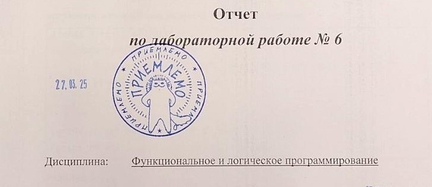

## Функциональное и логическое программирование
Курс вели
- Толпинская Н.Б.
- Строганов Ю.В.

Полезно, новая парадигма программирования, плюс в современных языках прослеживается, если не наследие, то схожие фрагменты

Защиты ЛР сдавали в основном Строганову Ю.В., а потом Толпинской Н.Б. так она гораздо быстрее и легче принимала, чем сразу к Толпинской Н.Б.

